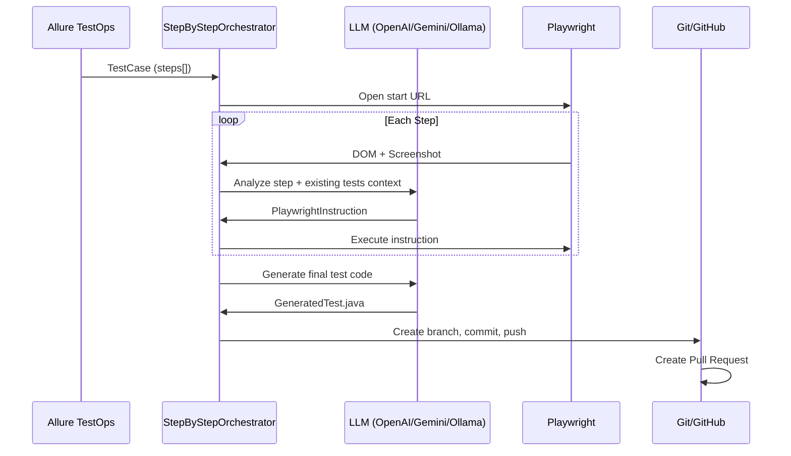

# LLM Test Agent

   

**AI-powered agent for generating UI automated tests from TMS test cases.**

Uses LLM to analyze DOM and screenshots, execute browser actions step-by-step, and generate ready-to-run Playwright tests. Supports automatic Git integration for committing tests and creating Pull Requests.

## Features

- 🔄 **Step-by-step execution**: Each test step is analyzed and executed individually
- 📸 **Visual analysis**: Uses DOM snapshots and screenshots for accurate locator generation
- 🧠 **LLM-powered**: Leverages OpenAI, Gemini, or Ollama for intelligent test generation
- 🔗 **TMS integration**: Fetches test cases from Allure TestOps
- 🌐 **n8n compatible**: REST API for workflow automation
- 📚 **Context-aware**: Uses existing tests as examples for consistent code style
- 🔀 **Git integration**: Auto-commit, push, and create PRs for generated tests
- ☕ **Java tests**: JUnit 5 + Playwright Java
- 📜 **TypeScript tests**: Playwright Test (coming soon)

## Architecture

```
llm-test-agent/
├── agent-core/          # Shared components (browser, models, TMS clients)
├── agent-java/          # Java JUnit 5 Playwright test generator
└── agent-typescript/    # TypeScript Playwright test generator (WIP)
```



## Quick Start

### Prerequisites

- Java 21+
- Maven 3.9+
- LLM API key (OpenAI, Gemini, or local Ollama)

### Installation

```bash
git clone https://github.com/alstafeev/llm-test-agent.git
cd llm-test-agent
mvn install
```

### Configuration

Set your LLM API key:
```bash
export OPENAI_API_KEY=your-key
# or
export GEMINI_API_KEY=your-key
```

### Usage

#### Shell (Interactive)
```bash
cd agent-java
mvn spring-boot:run

# In shell:
run-step-by-step --steps "Click login, Enter username" --url "https://example.com"
```

#### REST API
```bash
cd agent-java
mvn spring-boot:run

# Generate test
curl -X POST http://localhost:8080/api/v1/test-agent/generate \
  -H "Content-Type: application/json" \
  -d '{"title":"Login Test","steps":["Click login","Enter username"],"url":"https://example.com"}'
```

## Git Integration

Generated tests can be automatically pushed to a Git repository and create Pull Requests for review.

### Configuration

```yaml
agent:
  git:
    enabled: true
    repo-url: git@github.com:company/ui-tests.git
    base-branch: main
    test-path: src/test/java/generated
    create-pr: true
    pr-reviewers: john,jane
    local-repo-dir: target/test-repo
  github:
    api-url: https://api.github.com        # or corporate: https://git.adsrv.wtf/api/v3
    token: ${GITHUB_TOKEN}
```

### Workflow

1. Test saved locally to `agent.test-output-dir`
2. Test repository cloned/pulled
3. New branch created: `test/{test-name}`
4. Commit and push
5. Pull Request created with reviewers

## Existing Tests Context

The agent analyzes existing tests in the repository to generate new tests with consistent style:

- Loads up to 3 recent tests as examples
- Includes them in the LLM prompt as reference
- New tests follow the same patterns, imports, and structure

## Modules

| Module | Description |
|--------|-------------|
| `agent-core` | Shared components: browser management, models, TMS clients |
| `agent-java` | Java JUnit 5 Playwright test generator |
| `agent-typescript` | TypeScript Playwright test generator (placeholder) |

## API Endpoints

| Endpoint | Method | Description |
|----------|--------|-------------|
| `/api/v1/test-agent/health` | GET | Health check |
| `/api/v1/test-agent/generate` | POST | Generate and run test |
| `/api/v1/test-agent/analyze` | POST | Analyze steps (dry run) |
| `/api/v1/test-agent/webhook/n8n` | POST | n8n-compatible webhook |

## Configuration Reference

| Property | Description | Default |
|----------|-------------|---------|
| `agent.url` | Target website URL | `https://example.com` |
| `agent.test-output-dir` | Local test output directory | `src/test/java/generated` |
| `agent.browser.headless` | Run browser headless | `true` |
| `agent.browser.timeout` | Browser timeout (ms) | `30000` |
| `agent.git.enabled` | Enable Git integration | `false` |
| `agent.git.repo-url` | Test repository URL | - |
| `agent.git.base-branch` | Base branch for PRs | `main` |
| `agent.git.create-pr` | Create PR after push | `true` |
| `agent.github.api-url` | GitHub API URL | `https://api.github.com` |
| `agent.github.token` | GitHub PAT | `${GITHUB_TOKEN}` |
| `agent.allure.project` | Allure TestOps project ID | - |
| `agent.allure.rql` | Allure RQL filter | - |

## License

Apache License 2.0

## Author

**Aleksei Stafeev** - [@alstafeev](https://github.com/alstafeev)
